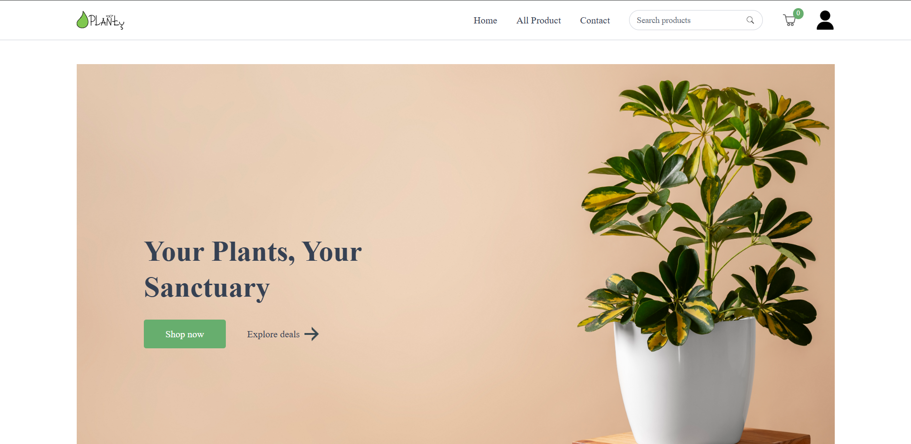
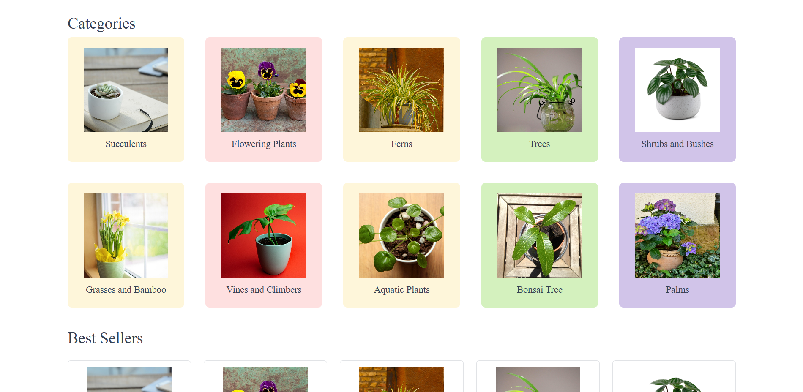
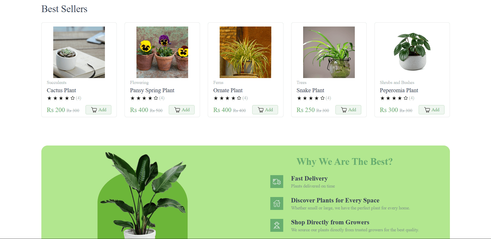
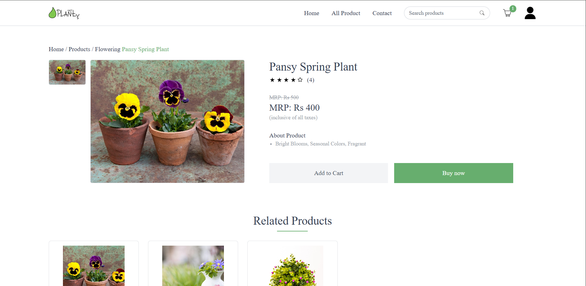
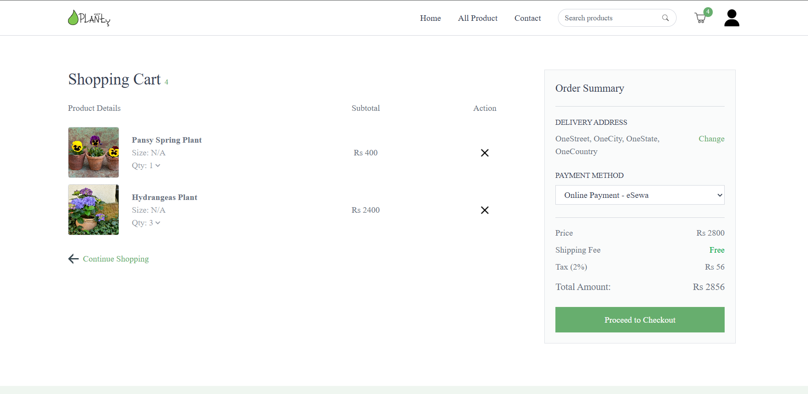
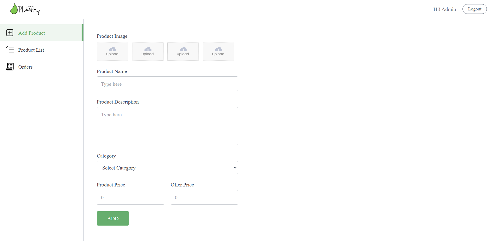

# Planty (Plant Ecommerce System)


Planty is a web-based plant store built with the MERN stack, enabling users to discover and purchase plants online while allowing sellers to manage products and orders efficiently. The platform features a responsive design and showcases modern web development techniques, secure payments, and database-driven functionality.

## Live Demo
You can view the live project > [](https://planty-delta.vercel.app/)

## Table of Contents
- [About](#about)
- [Live Demo](#live-demo)
- [Features](#features)
- [Built With](#built-with)
- [Getting Started](#getting-started)
  - [Prerequisites](#prerequisites)
  - [Installation](#installation)
- [Usage](#usage)
- [Project Structure](#getting-started)
- [Contributing](#contributing)
- [Logo License](#logo-license)
- [Acknowledgement](#acknowledgement)
- [Contact](#contact)

## About
Planty Plant is a plant e-commerce platform with a responsive design. Users and sellers can:
- Create an account, login, logout.
- Browse plants by category and view product details.
- Add plants to cart and complete purchases using Stripe or eSewa.
- Sellers can manage inventory, add or remove products, and view orders.
- See a user-friendly dashboard to track purchases and orders.
<br>

### Home Page


### Categories Page


### Best Seller Page
  

### Product Details Page


### Cart Page


### Add Product Page
 

## Features
- Responsive Design: Optimized for smooth browsing on different screen sizes.
- User Accounts: Users can register, login, and manage their profiles.
- Product Management: Sellers can add, update, or remove plants from inventory.
- Shopping Cart & Checkout: Users can add products to the cart and complete purchases using Stripe or eSewa.
- Order Management: Sellers can view and track customer orders.
- Categories & Search: Browse plants by categories and search for specific products.

## Built With
**Frontend:** React.js, HTML, Tailwind CSS, JavaScript  
**Backend:** Node.js, Express.js  
**Database:** MongoDB  
**Tools:** Figma(Banner, logo design), Postman (API testing), VsCode(IDE)  

## Getting Started
### Prerequisites
- Node.js v16 or later
- npm v8 or later
- MongoDB (local or Atlas)
- Optional: Postman (for testing APIs)

### Installation

**1. Clone the repository:**
```bash
git clone https://github.com/BinatoDrkLight/ProjectIIBCA6thSem.git
cd Planty
```

**2. Install frontend dependencies**
```bash
cd client 
npm install
```

**3. Install backend dependencies**
```bash
cd ../server
npm install
```

**4. Set .env variables with correct values**  
Rename .envEg to .env in both client and server folder and replace with correct values.

**5. Run program**
```bash
cd ../client
npm run dev
cd ../server
npm run server
```

**6. Open in any web with:**
```bash
https://localhost:5173
```

## Usage
- Users can register, log in, browse plants, and make purchases.
- Users can add products to the cart and checkout using Stripe or eSewa.
- Sellers can add, update, or remove plants from inventory.
- Sellers can view and track customer orders.

## Project Structure
- client/
- server/
- .gitignore
- README.md

## Contributing
- Report bugs or suggest features via GitHub Issues.
- Fork the repository and submit pull requests.

## Logo License
The project logo  is © 2025 BinatoDrkLight and licensed under CC BY 4.0. Please provide credit if used or modified.

## Acknowledgements
- [GreatStack](https://youtu.be/PaQX0pktLnw?si=MBWb9okoaqVdHhQp) (Tutorial)
- [Pixabay](https://pixabay.com), [Iconfinder](https://iconfinder.com), [Icons8](https://icons8.com) (Icons, images)
- [PrebuiltUi](https://prebuiltui.com) (UI design components)
- [Figma](https://figma.com) (UI design)
- [ChatGPT](https://chatgpt.com) (Assisted with solving issues)

## Contact
Author: Binesh Adhikari  
Email: binesh2adhikari@gmail.com  
GitHub: https://github.com/BinatoDrkLight/  
LinkedIn: https://www.linkedin.com/in/binesh-adhikari-it  
Project Live: https://planty-delta.vercel.app/